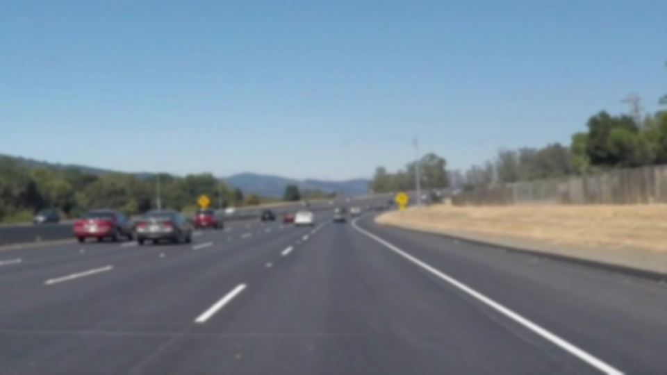
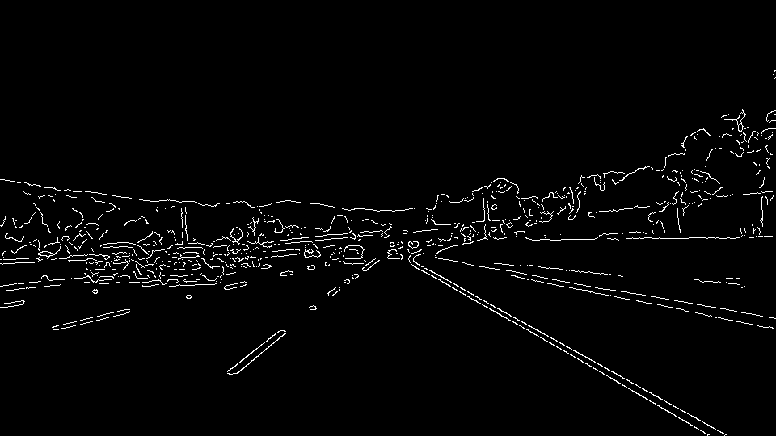
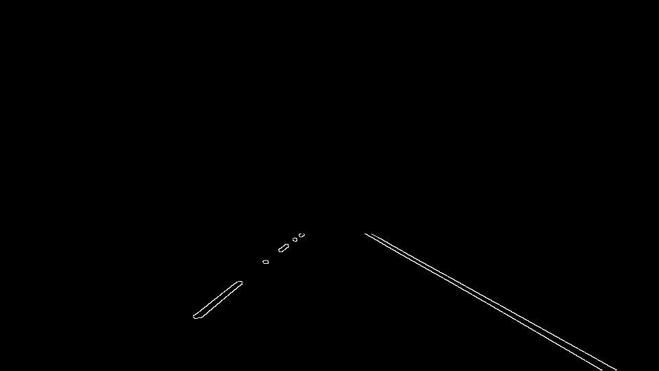
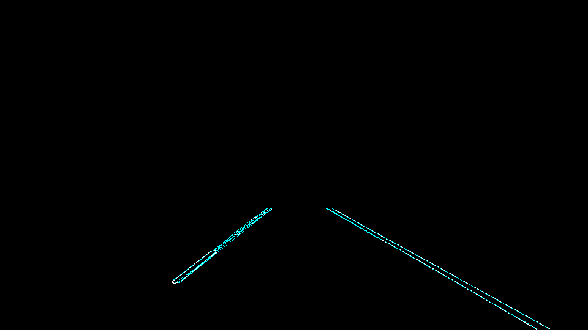
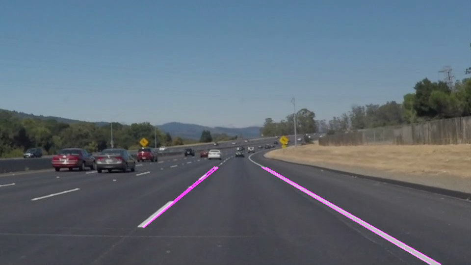
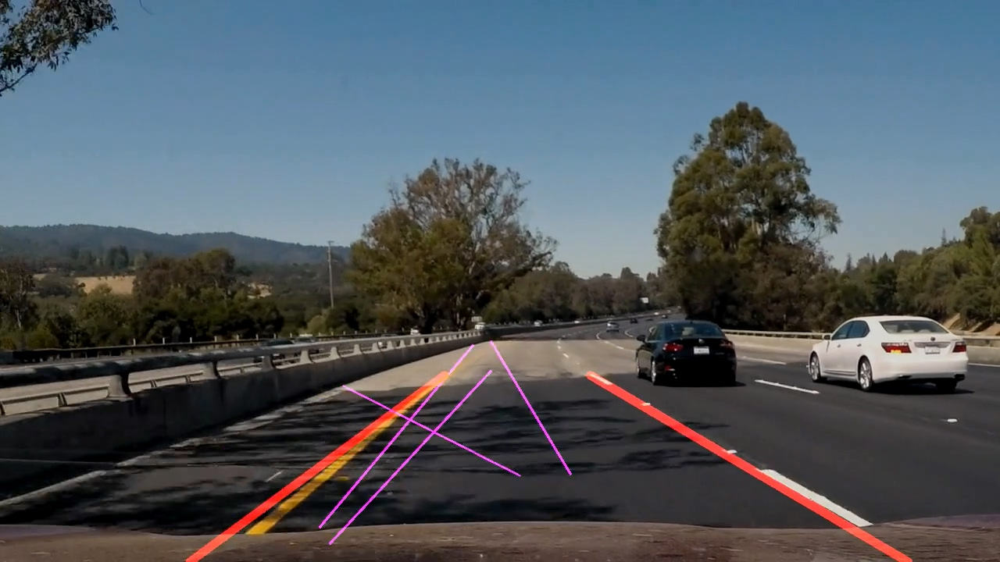
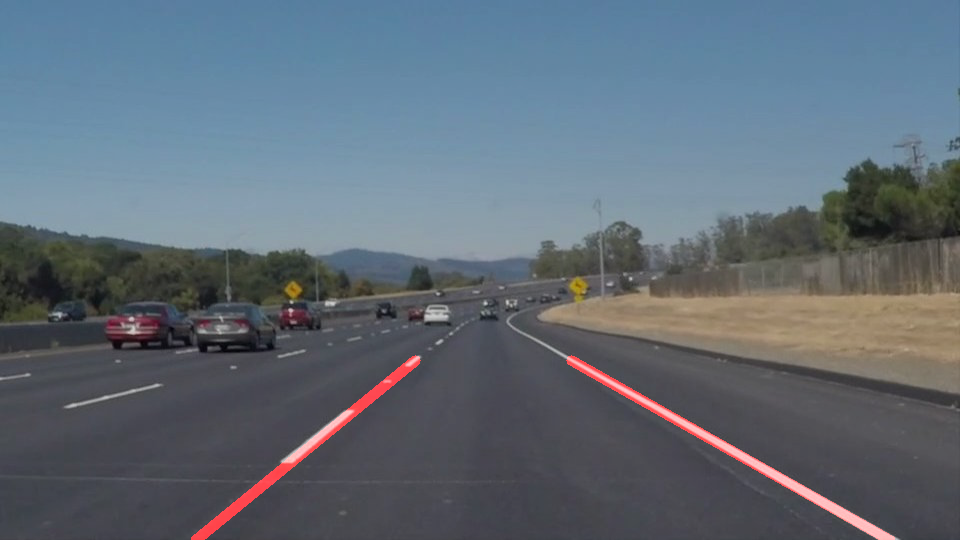

# **Finding Lane Lines on the Road** 

# Overview

When we drive, we use our eyes to decide where to go.  The lines on the road that show us where the lanes are act as our constant reference for where to steer the vehicle.  Naturally, one of the first things we would like to do in developing a self-driving car is to automatically detect lane lines using an algorithm.

# The Project

## Pipeline Description
1. Since we are dealing with video streams, it's necessary to extract frames from videos and process them one by one. Here is an image example extracted from one of the video.

2. After extracting image from video, I apply a Gaussian Blur to remove noise. I don't use gray scale image because when I face challenge video, I find out using gray scale image will lead to the dissapearance of yellow lane due to the strong sun light, whileas using RGB channel image works normally.

3. A Canny edges detection is applied after Gussian Blur.

4. After edges detection, I select a trapezoid region as my interest region.

5. Applying a Hough Transform on the image, I can find out all the straight lines that meet the requirement of gradient(angle) and others.

6. Among these straight lines, I want to distinguish the longest two lines on the left and on the right. They represent the edges of two lanes. Of course, the edges will not always be detected as we wish. Sometimes a small deviation will happen like the left lane, but it doesn't hurt much.

However, when this algorithm deals with complex situation like in the challenge video, finding two longest lines is far from sufficient. As the picture shown here, dominant lines are not always the lines we want due to the distortion. Thus a checklane() function is emplemented. This function checks if the dominant lines I find now are too far away from the last one I find. If they are, the new line will be rejected, and the last one therefore remains. As shown here, the right lane is rejected.

7. Finally, after checking the new line, I will draw it on the image. But to ensure a smooth change from frame to frame, the position change speed is restricted by a coefficient. Also, a tiny position change will be neglected.

## Result
I keep dominant lines and the lane I find in the video to better demosnstrate the algorithm.

## Shortcomings
1. When dealing with challenge video, I find out a short range of road is under great sunshine, which leads to the diappearance of the yellow line in gray scale image. Therefore, I use whole 3 channel instead of 1 gray channel image to solve this problem and this will definitely cause the algorithm to slow down.

2. Still, when facing challenge video, there are a lot of distortion that result in wrong lane detection and even wrong dominant lines detection. Although I use a checklane() function to exclude these lanes and make it working, the challenge video shows that this pipeline is prone to break down when handling complicated situation. (For example, if the lane detection is wrong at the first place, the checklane() function will not find out)

## Suggest possible improvement
1. Another color space besides "RGB" can be useful to solve strong sun light problem. For example, "HSL" whose "S" channel is more robust even facing sun light problem, can be a good solution.

2. Using plain simple straight lines to detect and fit road lanes may not be a very good solution due to the complexity of roads, vehicles, enviroment, etc. A better algorithm to detect lines and a different equation, polynomial equation for instance, to fit the lanes are needed.