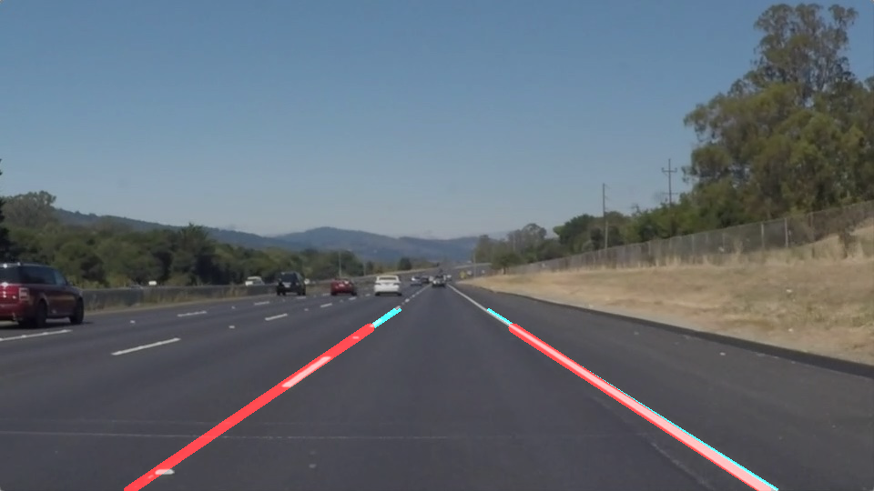

# **Finding Lane Lines on the Road** 

[]

#Overview
---

When we drive, we use our eyes to decide where to go.  The lines on the road that show us where the lanes are act as our constant reference for where to steer the vehicle.  Naturally, one of the first things we would like to do in developing a self-driving car is to automatically detect lane lines using an algorithm.

Creating a Great Writeup
---
For this project, a great writeup should provide a detailed response to the "Reflection" section of the [project rubric](https://review.udacity.com/#!/rubrics/322/view). There are three parts to the reflection:

1. Describe the pipeline

2. Identify any shortcomings

3. Suggest possible improvements

We encourage using images in your writeup to demonstrate how your pipeline works.  

All that said, please be concise!  We're not looking for you to write a book here: just a brief description.

You're not required to use markdown for your writeup.  If you use another method please just submit a pdf of your writeup. Here is a link to a [writeup template file](https://github.com/udacity/CarND-LaneLines-P1/blob/master/writeup_template.md). 

#The Project
---

##Pipeline Description
