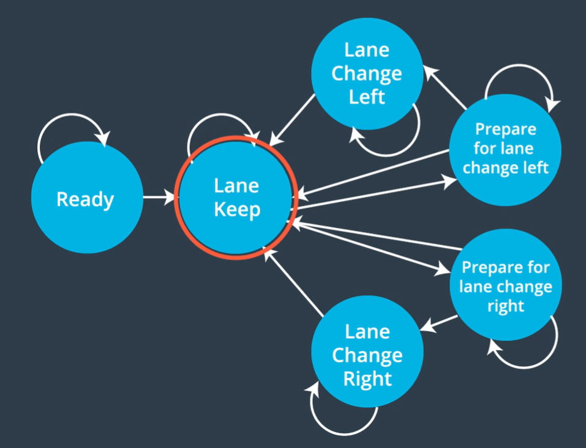

# Path Planning Project
Self-Driving Car Engineer Nanodegree Program

------

## Result Demonstration

### Video demonstration

[](https://youtu.be/PJqq0DKkakM)

### Goals
In this project, the goal is to safely navigate around a virtual highway with other traffic that is driving +-10 MPH of the 50 MPH speed limit. The car's localization and sensor fusion data are provide and there is also a sparse map list of waypoints around the highway. The car tries to go as close as possible to the 50 MPH speed limit, which means passing slower traffic when possible, note that other cars will try to change lanes too. The car should avoid hitting other cars at all cost as well as driving inside of the marked road lanes at all times, unless going from one lane to another. The car is able to make one complete loop around the 6946m highway. Since the car is trying to go 50 MPH, it takes a little over 5 minutes to complete 1 loop. Also the car should not experience total acceleration over 10 m/s^2 and jerk that is greater than 10 m/s^3.

## Dependencies

- cmake >= 3.5

  - All OSes: [click here for installation instructions](https://cmake.org/install/)

- make >= 4.1

  - Linux: make is installed by default on most Linux distros
  - Mac: [install Xcode command line tools to get make](https://developer.apple.com/xcode/features/)
  - Windows: [Click here for installation instructions](http://gnuwin32.sourceforge.net/packages/make.htm)

- gcc/g++ >= 5.4

  - Linux: gcc / g++ is installed by default on most Linux distros
  - Mac: same deal as make - [install Xcode command line tools]((https://developer.apple.com/xcode/features/)
  - Windows: recommend using [MinGW](http://www.mingw.org/)

- [uWebSockets](https://github.com/uWebSockets/uWebSockets)

  - Run either `install-mac.sh` or `install-ubuntu.sh`.

  - If you install from source, checkout to commit `e94b6e1`, i.e.

    ```
    git clone https://github.com/uWebSockets/uWebSockets 
    cd uWebSockets
    git checkout e94b6e1
    ```

#### Simulator

Download the Term3 Simulator which contains the Path Planning Project from the [releases tab (https://github.com/udacity/self-driving-car-sim/releases/tag/T3_v1.2).  

To run the simulator on Mac/Linux, first make the binary file executable with the following command:

```shell
sudo chmod u+x {simulator_file_name}
```

## Basic Build Instructions

1. Clone this repo.
2. Make a build directory: `mkdir build && cd build`
3. Compile: `cmake .. && make`
4. Run it: `./path_planning`.

Here is the data provided from the Simulator to the C++ Program

## DATA

#### The map of the highway is in data/highway_map.txt

Each waypoint in the list contains  [x, y, s, dx, dy] values. x and y are the waypoint's map coordinate position, the s value is the distance along the road to get to that waypoint in meters, the dx and dy values define the unit normal vector pointing outward of the highway loop.

The highway's waypoints loop around so the frenet s value, distance along the road, goes from 0 to 6945.554.

#### Main car's localization Data (No Noise)

["x"] The car's x position in map coordinates

["y"] The car's y position in map coordinates

["s"] The car's s position in frenet coordinates

["d"] The car's d position in frenet coordinates

["yaw"] The car's yaw angle in the map

["speed"] The car's speed in MPH

#### Previous path data given to the Planner

//Note: Return the previous list but with processed points removed, can be a nice tool to show how far along
the path has processed since last time. 

["previous_path_x"] The previous list of x points previously given to the simulator

["previous_path_y"] The previous list of y points previously given to the simulator

#### Previous path's end s and d values 

["end_path_s"] The previous list's last point's frenet s value

["end_path_d"] The previous list's last point's frenet d value

#### Sensor Fusion Data, a list of all other car's attributes on the same side of the road. (No Noise)

["sensor_fusion"] A 2d vector of cars and then that car's [car's unique ID, car's x position in map coordinates, car's y position in map coordinates, car's x velocity in m/s, car's y velocity in m/s, car's s position in frenet coordinates, car's d position in frenet coordinates. 

## Algorithm


##### 1, Sensor Fusion and Localization

In an actual self-driving car sensor data acquired and processed before planning subsystem. It helps the vehicle to understand the environment in order to localize itself and plan a trajectory. In this case, however, all the data of vehicle ego and the result of sensor fusion, in other word, the positions and states of other vehicles, are assumed to be well processed beforehand. All the vehicle information will directly come from the simulator.

##### 2, Prediction

Predict where the surrounding vehicles will be in the short future. A useful coordinate called Frenet coordinate system is introduced here due to the highway situation. A graph to demonstrate a Frenet coordinate sample is as followed.


In Frenet coordinate, `d` can be a representation of which lane the car is located and simply comparing `s` can we know if the vehicles is in front of or behind one another. The lane is 4 meters wide, so d = 4 and d = 8 are the boundary of these three lanes.

The prediction method is quite straight-forward here. Simply add the time elapsed multiplying velocity will give the future position of other vehicles. That way we can know where the vehicles are in the near future. 

##### 3, Behavior Planning

The driving behavior should be comfortable for human, which means a limited jerk, suitable acceleration and small turn. The requirements of this project state that the acceleration and jerk should not exceed 10 m/s² and 50m/s³. With elapsed time of 0.02 seconds, the car acceleration is increased or decreased by steps of 0.224 mph. Thus the desired speed changing rate is 0.224 mph.

A finite state machine is defined here including staying in the lane, prepare lane change left, prepare lane change right, changing to left lane and changing to right lane.



The lane keeping state is simple. If there is no car in front, the vehicle will accelerate until reaching the limited speed. If there is a vehicle in front and the distance from it is smaller than a safety distance, the vehicle slows down.

To decide whether the vehicle should change lane when a car is in front or not, a cost function is defined to solve the problem. The vehicle detects the closest vehicles in front of and behind it in each of the three lanes. If there is a vehicle staying at the same lane in front of it and its speed is slower than 30 mph, it goes to prepare for lane change states. The change is implemented by evaluating `is_too_close` and `ref_vel`.

Afterwards, if vehicles, in front of and behind the vehicle, in one of the other lane are further from the vehicle than the safety distance, meanwhile their speed is suitable for current vehicle to change lane, the decision of changing lane then is made. In the project. The front safety distance is 35 while the rare safety distance is 25. And for suitable speed, it means that the vehicle should be faster rare speed but slower than 0.8 times the front speed. The change is implemented by evaluating `right_lane_gap_avail` and `left_lane_gap_avail`.

Changing lane is represented by the change of `lane`.

##### 4, Trajectory Generation

The path planner generate equally spaced map coordinate using `getXY()` and changes the coordinates of points from Freenet coordinate to Cartesian coordinates. Afterwards, the global coordinate is transformed to local coordinate with respect to the vehicle.

For fitting curve, a very useful library named Spline is used here to create a smooth trajectory after having planning points. The path planner uses the Spline to fit the generated map coordinates in order to generate a trajectory. Finally, the planner computes the points' coordinates from Spline curve.

The code is available in [spline.h](https://github.com/eduribeirocampos/Path-Planning_Highway-driving/blob/master/src/spline.h).

#### Other Details

1. The car uses a perfect controller and will visit every (x,y) point it receives in the list every .02 seconds. The units for the (x,y) points are in meters and the spacing of the points determines the speed of the car. The vector going from a point to the next point in the list dictates the angle of the car. Acceleration both in the tangential and normal directions is measured along with the jerk, the rate of change of total Acceleration. The (x,y) point paths that the planner receives should not have a total acceleration that goes over 10 m/s^2, also the jerk should not go over 50 m/s^3. (NOTE: As this is BETA, these requirements might change. Also currently jerk is over a .02 second interval, it would probably be better to average total acceleration over 1 second and measure jerk from that.
2. There will be some latency between the simulator running and the path planner returning a path, with optimized code usually its not very long maybe just 1-3 time steps. During this delay the simulator will continue using points that it was last given, because of this its a good idea to store the last points you have used so you can have a smooth transition. previous_path_x, and previous_path_y can be helpful for this transition since they show the last points given to the simulator controller with the processed points already removed. You would either return a path that extends this previous path or make sure to create a new path that has a smooth transition with this last path.
