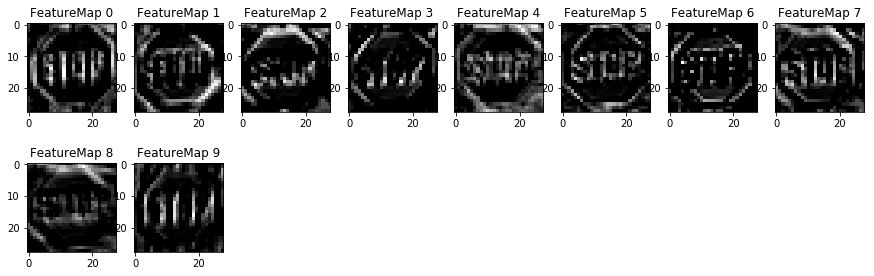
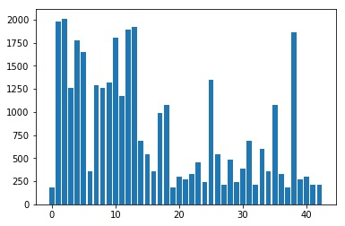
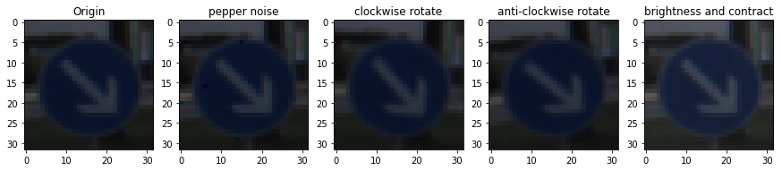
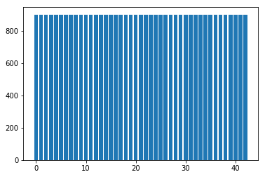
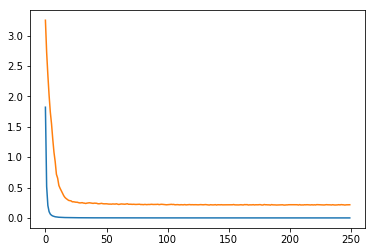
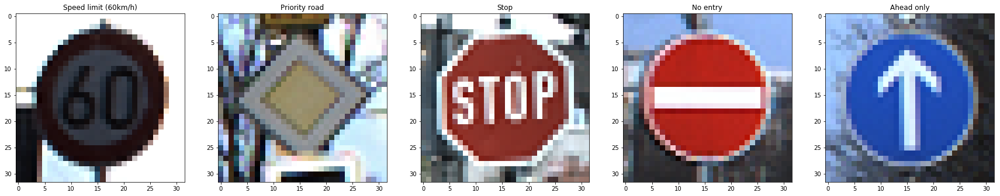
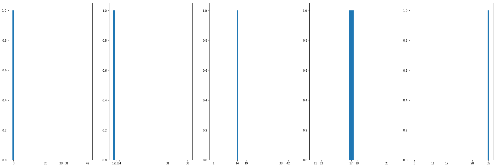
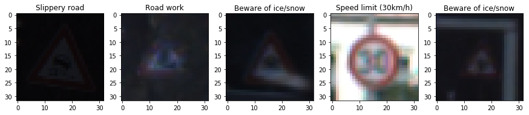
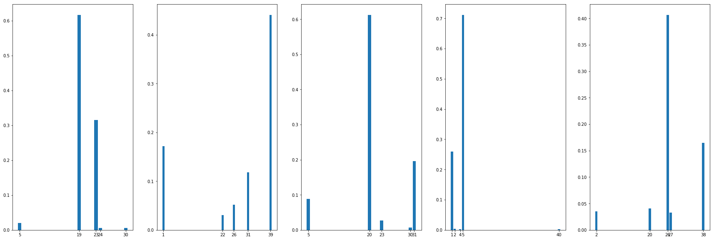

# Project: Build a Traffic Sign Recognition Program

[](http://www.udacity.com/drive)



## Overview

In this project, deep neural networks and convolutional neural networks architecture is built to classify traffic signs. The data set used in this project is [German Traffic Sign Dataset](http://benchmark.ini.rub.de/?section=gtsrb&subsection=dataset). After the model is trained, a further discussion about model prediction and network visulization is made.


## The Project

The goals / steps of this project are the following:

* Load the data set
* Explore, summarize and visualize the data set
* Design, train and test a model architecture
* Use the model to make predictions on new images
* Analyze the softmax probabilities of the new images
* Summarize the results with a written report


### Dependencies
This lab requires:

* [CarND Term1 Starter Kit](https://github.com/udacity/CarND-Term1-Starter-Kit)

The lab environment can be created with CarND Term1 Starter Kit. Click [here](https://github.com/udacity/CarND-Term1-Starter-Kit/blob/master/README.md) for the details.


### Dataset and Repository

1. Download the data set. The classroom has a link to the data set in the "Project Instructions" content. This is a pickled dataset in which we've already resized the images to 32x32. It contains a training, validation and test set.
2. Clone the project, which contains the Ipython notebook and the writeup template.
```sh
git clone https://github.com/udacity/CarND-Traffic-Sign-Classifier-Project
cd CarND-Traffic-Sign-Classifier-Project
jupyter notebook Traffic_Sign_Classifier.ipynb
```


### Data Set Summary & Exploration

I used the numpy library to calculate summary statistics of the traffic
signs data set before data agumentation:

* The size of training set is 34799
* The size of the validation set is 4410
* The size of test set is 12630
* The shape of a traffic sign image is (32, 32, 3)
* The number of unique classes/labels in the data set is 43

Here is an exploratory visualization of the training set. It is a bar chart showing how the data of each label is distributed. We can see some of the labels have more training images thatn the others, which can affect the result of training process. Because if something shows up more frequently than the others, the model tends to believe what it sees is it.



Since the data set has a unbalance labels distribution problems, I decide to balance the training set using data augmentation technique, in another word, increase the number of labels that are fewer, and decrease the larger ones. 

I choose four usual data augmentation techniques: 

* Add Pepper noise
* Rotate image clockwise (5°)
* Rotate image anti-clockwise (5°)
* Enhance brightness and contract

Here is an data augmentation result sample used on a random image



After data agumentation, the distribution becomes:



which is very ideal.
And the final summary of training set:

* The size of training set is 34799
* The shape of a traffic sign image is (32, 32, 3)
* The number of unique classes/labels in the data set is 43

After data augmentation, I decided to convert the images to grayscale because a grayscale image will not lose too much useful information but will greatly decrease the calculation.

As a last step, I normalized the image data because it can increase the model training speed.


### Neural Network Architecture
My final model consisted of the following layers:

```
| Layer         		|     Description	        					|
|:---------------------:|:---------------------------------------------:| 
| Input         		| 32x32x3 RGB image   							| 
| Convolution 5x5/10fm  | 1x1 stride, valid padding, outputs 28x28x10 	|
| Batch normalization   |												|
| RELU					|												|
| Max pooling	      	| 2x2 stride, same padding, outputs 14x14x64 	|
| Convolution 3x3/20fm  | 1x1 stride, valid padding, outputs 12x12x20 	|
| Batch normalization   |												|
| RELU					|												|
| Max pooling	      	| 2x2 stride, same padding, outputs 6x6x20		|
| Flatten				| outputs 720 									|
| Fully connected 160	| outputs 160        							|
| Batch normalization   |												|
| RELU					|												|
| Fully connected 120	| outputs 120        							|
| Batch normalization   |												|
| RELU					|												|
| Fully connected 43	| outputs 43        							|
| Batch normalization   |												|
| Softmax				|												|
```

I choose LeNet architecture to start my project because it is a classical well-known network to identify letters. It is not complex, fast to train and still powerful. 

From my perspective, traffic signs have a lot to do with shapes and signs. So I believe a LeNet architecture will work well in this situation.

To meet the specific requrements, I change some of the parameters of the neural network. I change the final output to 43 as required. I increase the fully connected network from 120->84->10 to 160->120->43. What's more, I increse the frame of the first layer from 6 to 10 and second one from 10*10*16 to 12*12*20 for traffic signs are more complicated thus having more features.

I used the "Batch Normalization" technique which can be helpful to prevent overfitting and increase training speed(allow a large speed_rate). I also set a large batch size to prevent overfitting.


### Training the Model

To train the model, I used:

* Optimizer: AdamOptimizer
* Batch size: 2048
* Epochs: 250
* Learning rate: 0.0069

I choose a batch size of 2048 to avoid overfitting problem. And a relatively small learning rate can make sure the learning won't be too slow and still maintain a stable loss decrease. What's more, a smaller learning rate, although makes the loss to decrease slower at first, but allow the model to reach a lower validation loss at the end. Finally, an epoch of 250 is chosen because the loss keeps decreasing before 250. But after 250, the decrease process is not that obvious.

The training history is plotted here:



My final model results were:

* training set loss of 0.0000
* validation set loss of 0.2167
* validation set accuracy of 0.947
* test set accuracy of 0.935

We can see both training loss and validation loss decrease along with the epoch increases, which means the model learns well and no obvious overfitting occurs.

The result is not bad with a validation accuracy of , and a test accuracy of. However, the test accuracy is not so good as validation accuracy. Maybe the model's generalization ability is not good enough.


### Test a Model on New Images

#### 1, Images from Internet

Here are five German traffic signs that I found on the web:



The images are stable and quite clear so it should not be difficult to classify. But 
usually, the wrongly predicted images are those with complicated backgroud and unclear and dark signs.

Here are the results of the prediction:

```
| Image			        |     Prediction	        					| 
|:---------------------:|:---------------------------------------------:| 
| Speed limit (60km/h)  | Speed limit (60km/h)   						| 
| Priority road     	| Priority road 								|
| Stop					| Stop											|
| No entry	      		| No entry					 					|
| Ahead only			| Ahead only      								|
```

The model was able to correctly guess all traffic signs, which gives an accuracy of 100%, which is much better than the result of checking on test set. 

It's actually obvious to tell. For these 5 images are taken in good condition, clear and stable. However, test set contains a lot of images that are not clear, vibrating, and even difficult for human eyes to distinguish.(see the section about wrongly predicted images)

For all the correctly predicted images, the top 5 predicted classes of each image are shown in the bar charts below. 



We can see clearly that the possiblities are all higher than 99%, which means the model gives a high-certainty prediction.


#### 2, Wrongly predicted images from test set

I exact some of the wrongly predicted images from test data set then plot their top 5 softmax probabilities on bar charts. Here are the results





With the wrongly predicted images printed out, we can see they are some not easy to distinguish even with human eyes. And the bar charts and tables show that although the model gives a wrongly predicted result, it is not quite sure of what it predicts since the probabilities are all lower than .


### Visualizing the Neural Network (See Step 4 of the Ipython notebook for more details)

I visualize the first convolutional layer after activation.


Above are the visualized feature maps of the first convolutional layer after activation. We can see from the different feature maps that different filteres are looking for different features of the images. Although we can not tell exactly what the features are considered "interesting" to each filter, we can still tell that traffic sign's boundary and the sign itself are highly activated.

For example, FeatureMap1 focus on the sign "STOP" while FeatureMap4 activates both the boundary of the board and the "STOP" sign.

From my opinion, the neural network is always considered as a "Black Box' because we can't easily control the result of the training. Every time I trained gave a different FeatureMap result, which is quite confusing. Although the network works, not be able to see what exactly the network is interested in makes the network a "Black Box".