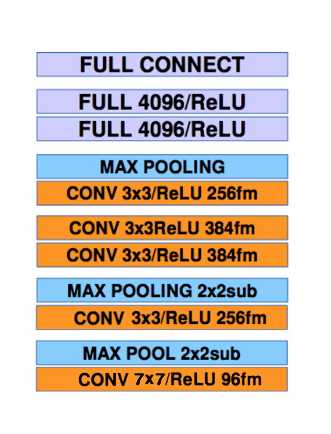
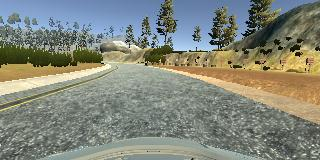
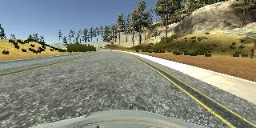
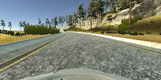
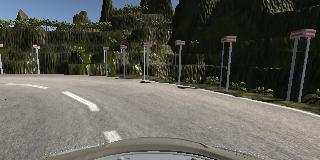
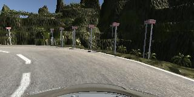
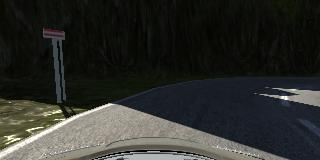
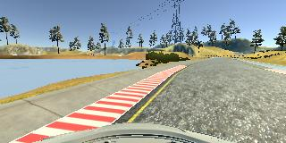
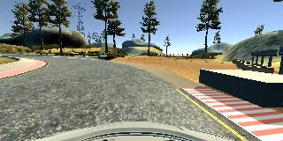

# Behavioral Cloning Project

[](http://www.udacity.com/drive)


## Result Demonstration
### Video demonstration
[](http://www.udacity.com/drive)


## Overview

Thanks to the help of Deep Neural Network, we are now able to teach computer to see and understand the content in the images. 

Udacity has developed a diriving simulator to help simulating the learning process of self-driving car in real world. It allows human to control the vehicle and  pictures of roads will be taken while running. Afterwards, these pictures can be used to train a deep neural network, which will allow our vehicle to drive all by itself on the track.


## The Project

The goals / steps of this project are the following:
* Use the simulator to collect data of good driving behavior 
* Design, train and validate a model that predicts a steering angle from image data
* Use the model to drive the vehicle autonomously around the first track in the simulator. The vehicle should remain on the road for an entire loop around the track.
* Summarize the results with a written report

### Dependencies
This lab requires:

* [CarND Term1 Starter Kit](https://github.com/udacity/CarND-Term1-Starter-Kit)

The lab enviroment can be created with CarND Term1 Starter Kit. Click [here](https://github.com/udacity/CarND-Term1-Starter-Kit/blob/master/README.md) for the details.

The following resources can be found in this github repository:
* drive.py
* video.py
* writeup_template.md

The simulator can be downloaded from the classroom. In the classroom, we have also provided sample data that you can optionally use to help train your model.


### Files Submitted & Code Quality

My project includes the following files:

* model.py containing the script to create and train the model
* drive.py for driving the car in autonomous mode
* model.h5 containing a trained convolution neural network 
* README.md summarizing the results

Using the Udacity provided simulator and my drive.py file, the car can be driven autonomously around the track by executing 
```
python drive.py model.h5
``` 
or simply
```
python drive.py
``` 


### Model Architecture and Training Strategy

#### An appropriate model architecture has been employed

My model architecture is trasferred from AlexNet, and my final architecture is shown below:



It can be found in model.py lines 90-127. 

In comparison to AlexNet, I change last two fully connected layer from 4096->1000 to 1000->1 to meet project requirement. Also, since my computer is not strong enough (And in China we cannot acquire AWS service), I reduce the first convolution layer from a kernel size of 11x11 to 7x7.

The data images are cropped as we only focus on the road region(code line 96), and the data is normalized in the model using a Keras lambda layer (code line 98). Additionally, the model includes RELU layers to introduce nonlinearity.

#### Attempts to reduce overfitting in the model

The model contains dropout layers in order to reduce overfitting (model.py lines 117, 120). Max pooling is also a method to reduce overfitting (model.py lines 103, 106, 113).

The model was trained and validated on different data sets to ensure that the model was not overfitting (code line 87). The model was tested by running it through the simulator and ensuring that the vehicle could stay on the track.

#### Model parameter tuning

The model used an adam optimizer, so the learning rate was not tuned manually (model.py line 25). I use a batch size of 256 so my computer can run the training without exceeding memory limit (model.py line 151). What's more, a epoch of 15 is set (model.py line 166). Because I find out after epoch15, the loss decreases very slowly and even vibrates which is a sing of overfitting.

#### Appropriate training data

Training data was chosen to keep the vehicle driving on the road. 

I use a combination of center lane driving, center-left driving, center-right drving clockwise and anti-clockwise on the track 1 as the basic training data of track 1. I use center-left and center-right because I want to use data from both track to train the model so that the car can run on both track. But after training using track 2 data. The car tends to steer more frequently. So I allow the car to run a bit more left or right to the center on track 1 to avoid unneccessary steering.



 

For the second track, I drive 3 times clockwise and anti-clockwise to collect data.



What's more, to successfully pass some difficult sections of track 1 and track 2, examples are shown below, I collect more data about these sections by running the car a few more times in different situations to pass these sections.

 

 

Since I use only the center camera iamge, after the collection process, I have 13215 number of data points. I then preprocesse this data by cropping image and normalization (done in keras).

I finally randomly shuffled the data set and put 20% of the data into a validation set. 


### Solution Design Approach

The overall strategy for deriving a model architecture is to transfer the AlexNet and change some parameters to fit project situations.

My first step was to use a simple LeNet. But the result was not quite satifactory since the car always rushed into the lake...

Then I decided to transfer AlexNet, I firstly changed the final layer from 1000 to 1, so that it returns a exact steering angle. Sadly, the computer warned me that I was running out ot memory. So I had to change the first convolutional filter size from 11x11 to 7x7.

In order to gauge how well the model was working, I split my image and steering angle data into a training and validation set. I found that my first model had a low loss on the training set but a high loss on the validation set. This implied that the model was overfitting. 

To combat the overfitting, I changed last but one fully connected layer from 4096 to 1000. Also, I decreased the dropout keep probability to only a half.

Now the loss of both train and validation decrease stably.

The final step was to run the simulator to see how well the car wass driving around track one. There were a few spots where the vehicle fell off the track. I was only using Track 1 and Track 2 data set at that time. To improve the driving behavior in these cases, I added  some an enhance data set, which was to drive a few more times in different situations in those sections in order to teach the car how to deal with these situations.

At the end of the process, I set a limit speed of 15 km/h on track 2 since the track 2 is indeed complicated, and maintain 30 km/h on track 1. The vehicle is able to drive autonomously around the track 1 and track 2 without leaving the road.


