# Advanced Lane Finding

## Result Demonstration
### Video demonstration

[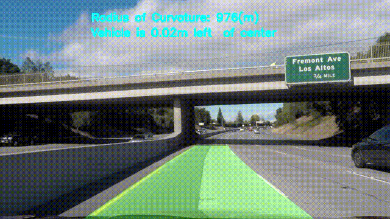](https://www.youtube.com/watch?v=u_qY0bvhmsg)

## Overview

In project 1, we built a lane finding algorithm to deal with simple road situation. But in reality, things are always much more complicated. Thus, A advanced software pipeline to identify the lane boundaries is needed and this project is good solution to deal with complex situation.

## The Project

The goals / steps of this project are the following:

* Compute the camera calibration matrix and distortion coefficients given a set of chessboard images.
* Apply a distortion correction to raw images.
* Apply a perspective transform to undistorted images.
* Use color transforms, gradients, etc., to create a thresholded binary image.
* Detect lane pixels and fit to find the lane boundary.
* Determine the curvature of the lane and vehicle position with respect to center.
* Warp the detected lane boundaries back onto the original image.
* Output visual display of the lane boundaries and numerical estimation of lane curvature and vehicle position.

### Camera Calibration

The code for this step is contained in the 2nd to 5th code cell of the IPython notebook "advanced_lane_finding.ipynb"

I start by preparing "object points", which will be the (x, y, z) coordinates of the chessboard corners in the world. Here I am assuming the chessboard is fixed on the (x, y) plane at z=0, such that the object points are the same for each calibration image.  Thus, `objp` is just a replicated array of coordinates, and `objpoints` will be appended with a copy of it every time I successfully detect all chessboard corners in a test image.  `imgpoints` will be appended with the (x, y) pixel position of each of the corners in the image plane with each successful chessboard detection.

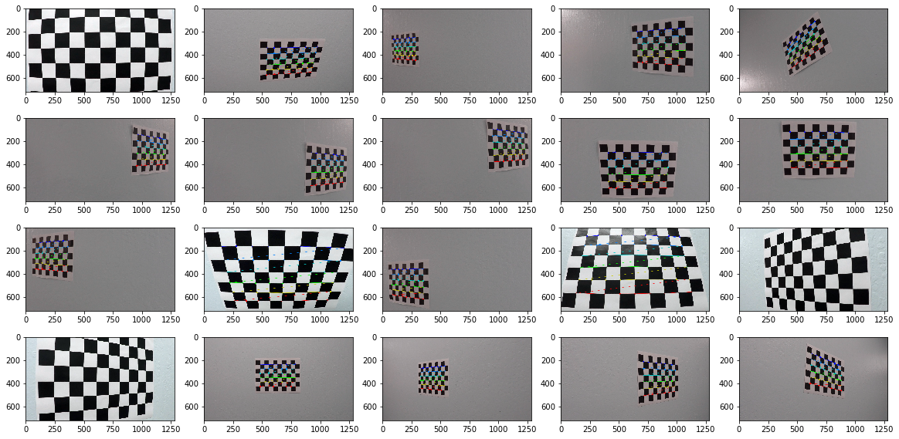

I then used the output `objpoints` and `imgpoints` to compute the camera calibration and distortion coefficients using the `cv2.calibrateCamera()` function. I applied this distortion correction to the test image using the `cv2.undistort()` function and obtained this result: 

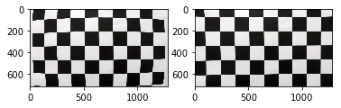

### Pipeline (single image)

#### 1. An example of a distortion-corrected image.

I use the function `cv2.undistort()` and apply the distortion correction to one of the test images like this one:

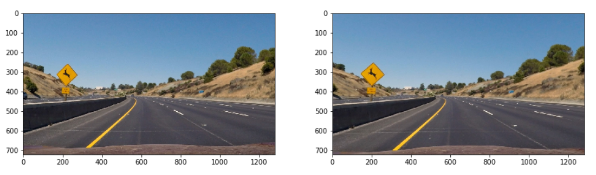

#### 2. Decision of perspective transform "src" and "dst" points

The code for my perspective transform includes a function called `perspective_trainsform(undist_image)`, which appears in the 6th code cell of the IPython notebook. The function takes as inputs an image (`img`). Important variable source (`src`) and destination (`dst`) points are set in the function. I chosoe the hardcode the source and destination points in the following manner:

	offset = 200
	src = np.float32(
	    [[552, y_size*2/3],
	     [738, y_size*2/3],
	     [1120, y_size],
	     [200, y_size]])
	dst = np.float32(
	    [[offset, 0],
	     [x_size-offset, 0],
	     [x_size-offset, y_size],
	     [offset, y_size]])

This resulted in the following source and destination points:

	| Source        | Destination   | 
	|:-------------:|:-------------:| 
	| 552, 480      | 200, 0        | 
	| 738, 480      | 1080, 720     |
	| 1120, 720     | 1080, 720     |
	| 200, 720      | 200, 0        |

I verified that my perspective transform was working as expected by drawing the `src` and `dst` points onto a straight-line test image and its warped counterpart to verify that the lines appear parallel in the warped image.

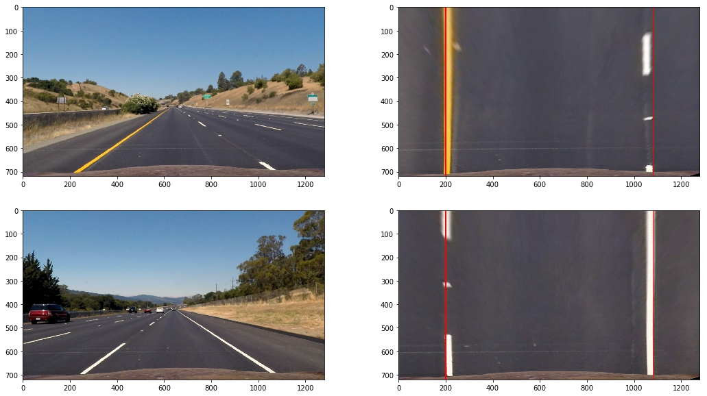

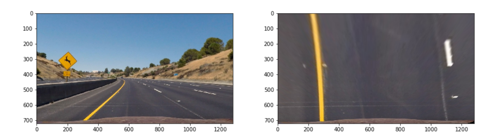

#### 3. Create a threshold mask and relevant binary image.

I used a combination of color and gradient thresholds to generate a binary image in the 9th code cell of notebook.  Here's an example of my output for this step.

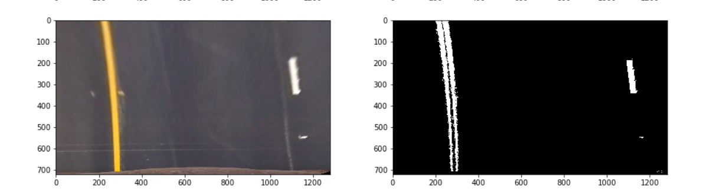

The core code is shown below

    # Create a mask
    # ((White & Yellow) & (mag_exclude_weak) & (dir_verticle)) | (White_supplement)
    mask = (((r_channel >= r_thresh[0]) & (r_channel <= r_thresh[1]) |\
             (s_channel >= s_thresh[0]) & (s_channel <= s_thresh[1])) &\
            ((mag >= mag_thresh[0]) & (mag <= mag_thresh[1])) &\
            ((dire >= dir_thresh[0]) & (dire <= dir_thresh[1])) |\
           ((gray >= gray_thresh[0]) & (gray <= gray_thresh[1])))

I use a quite triky way to create the mask. Firstly, since r channel from RGB and s channel from HLS can well detect white line and yellow line, I use a `|` as combination of these two to find basic line pixels. Then I apply magnitude threshold and direction threshold with a `&` to exclude noise pixels. Finally, in the challenge video, I encounter a problem that sometimes strong white light will affect the result of white line detection since white line is not that obvious at the first place. Therefore, a gray threshold with extreme 232-255 is added with `|` to help enhance only the white line pixels.

#### 4. Fit line positions

From 11th to 13th code cells of the notebook I implement a method to fit the pixels with polynomial equation and draw them and fill up the space between them.

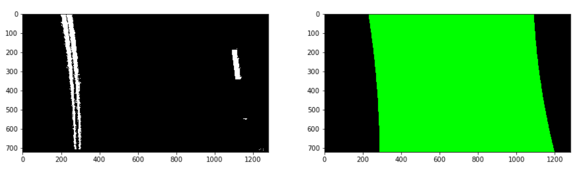

The function used to fit polynomial lines is `fit_and_cal_curvature_offset(image, left_line, right_line)`, which takes an image and two Line() class as parameters and return a road filled up image. 

This function firstly check if there is prior fit lines' information, if there isn't, it will call a `sliding_windows` technique to initialize a straght line fit to approximately locate the line pixels. Secondly, a `fit_from_prior` function is called, which can use the last fit result to locate pixels and give a new fit result. After new lines are detected, a `check_lines` function is called to see if they are reasonable and qulified. If they are not, the new lines will pass and the old ones stay. If they are, the old ones will smoothly change to the new ones.

#### 5. Calcalution of lane curvature and offset.

I did this in 12th code cell.

To measure curvature, a fit polynomial equation in meters is needed. Thus the pixels should be transfered to meter unit and be fitted firstly. Then using the equation of curvature on the fit result can give us the curvature.

To measure the offset from the center, I use the fit result in pixel unit and calculate the x position when y==ysize. Then a difference between x position and image midpoint multiply the conversion coefficient will return the offset of the vehicle.

#### 6. Unwarp lane image back to original image.

I implemented the function `unwarp_found_region(undist_image, lane_image, Minv, curvature, offset)` in 15th code cell of the notebook. It takes origin image and found lane image, reverse warped matrix as inputs used for unwarping. `cv2.warpPerspective` helps to unwarp the image and `cv2.addWeighted` combines unwarped line image and origin image together. I also print out curvature and offset information.

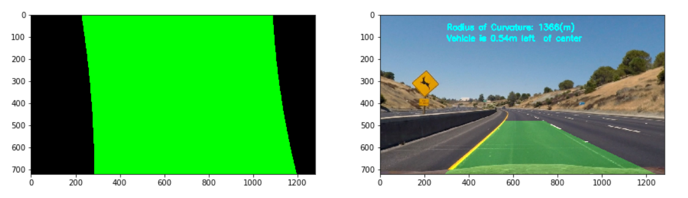

---

### Pipeline (video)

#### 1. Provide a link to your final video output.  Your pipeline should perform reasonably well on the entire project video (wobbly lines are ok but no catastrophic failures that would cause the car to drive off the road!).

[Project Video](./output/project_video.mp4)

[Challenge Video](./output/challenge_video.mp4)

---

### Discussion

#### 1. Problems and Future Work

When I was dealing with the challenge video, there is a section when the vehicle comes out of the bridge. In that point, the light of the image highly increases, which leads to the undetectable of yellow lanes. Yellow lanes are no longer "yellow" but "gray" under the bridge (although human eyes still "believe" it's yellow, but a image processing software tells me it's indeed gray), while the yellow lane outside the bridge is very clearly.  

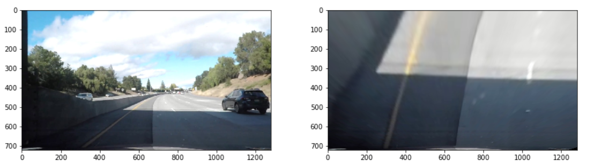

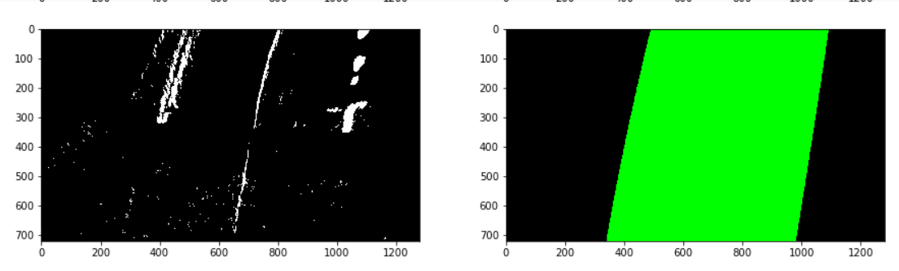

Luckily, the bridge section is not very long so with the help of lines detected before, I can just simply skip this frame and still remains a good result. But if the bridge section is a lot longer than this one, my pipeline will tend to fail.

What's more, my pipeline failed severely in harder_challenge_video. There are too many problems. The detection area, the lanes checking function and what to do when one of the lane is missing? These are all challenging in future work. 