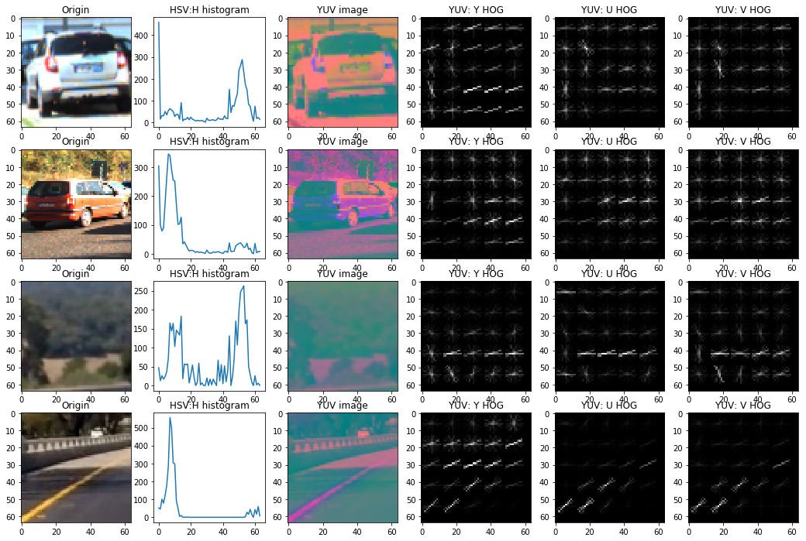
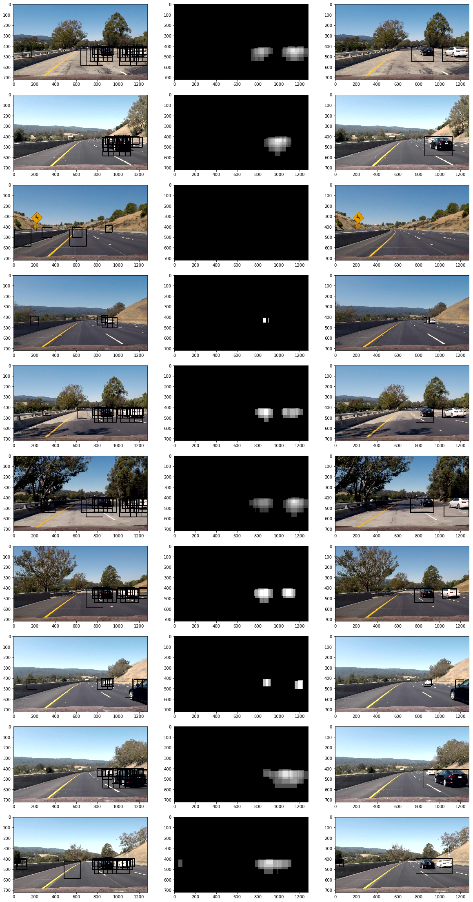
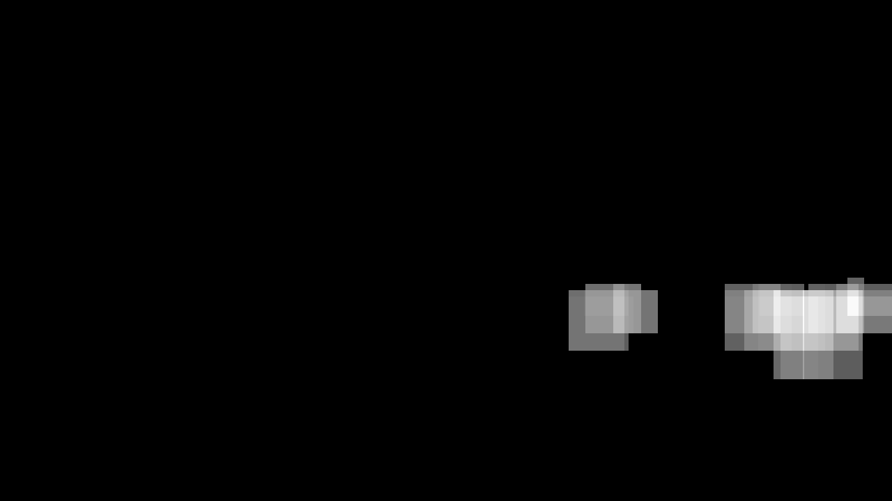
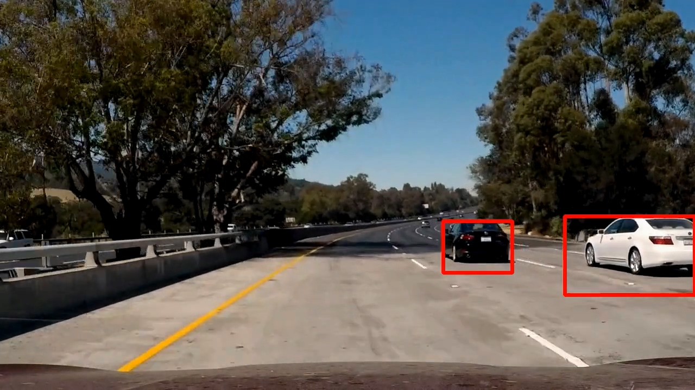
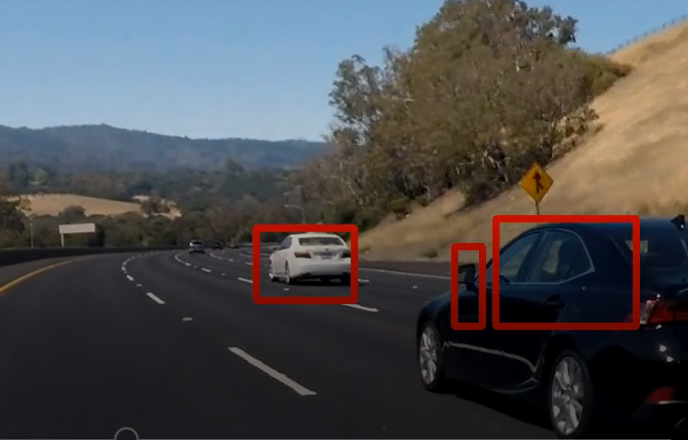
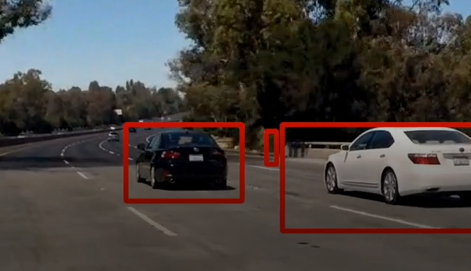
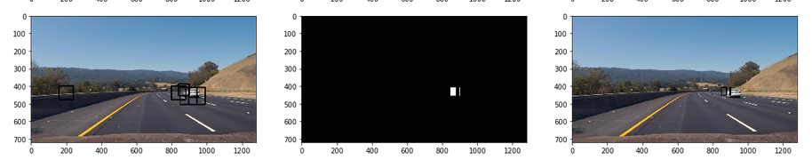

# Vehicle Detection

## Result Demonstration
### Video demonstration

## Overview

This project is to write a software pipeline to detect vehicles in a video. Use HOG and color histogram features extrated from vehicle and non-vehicle images to train a SVM classifier. Implement a sliding windows to find and use SVC to detect vehicle positions.

## The Project

The goals / steps of this project are the following:

* Perform a Histogram of Oriented Gradients (HOG) feature extraction on a labeled training set of images and train a classifier Linear SVM classifier
* Optionally, you can also apply a color transform and append binned color features, as well as histograms of color, to your HOG feature vector. 
* Note: for those first two steps don't forget to normalize your features and randomize a selection for training and testing.
* Implement a sliding-window technique and use your trained classifier to search for vehicles in images.
* Run your pipeline on a video stream (start with the test_video.mp4 and later implement on full project_video.mp4) and create a heat map of recurring detections frame by frame to reject outliers and follow detected vehicles.
* Estimate a bounding box for vehicles detected.

### Data set

Here are links to the labeled data for [vehicle](https://s3.amazonaws.com/udacity-sdc/Vehicle_Tracking/vehicles.zip) and [non-vehicle](https://s3.amazonaws.com/udacity-sdc/Vehicle_Tracking/non-vehicles.zip) examples to train your classifier.  These example images come from a combination of the [GTI vehicle image database](http://www.gti.ssr.upm.es/data/Vehicle_database.html), the [KITTI vision benchmark suite](http://www.cvlibs.net/datasets/kitti/), and examples extracted from the project video itself.   You are welcome and encouraged to take advantage of the recently released [Udacity labeled dataset](https://github.com/udacity/self-driving-car/tree/master/annotations) to augment your training data.  

### Pipeline

#### 1. Extract features from images.

The code for this step is contained in the 2nd, 3rd code cells.

I started by reading in all the `vehicle` and `non-vehicle` images.  Here is an example of one of each of the `vehicle` and `non-vehicle` classes.

I found out H channel of HSV color histogram is a useful features.

I then explored different color spaces and different `skimage.hog()` parameters (`orientations`, `pixels_per_cell`, and `cells_per_block`).  I grabbed random images from each of the two classes and displayed them to get a feel for what the `skimage.hog()` output looks like.

Here is an example using the `H` color space of `HSV` and `YUV` HOG parameters of `orientations=12`, `pixels_per_cell=(12, 12)` and `cells_per_block=(2, 2)`:

#### 2. settlement on final choice of HOG parameters.

The key factor affects the training time and detection time is the features length. So it's important to find out which features give a good prediction but need fewer features extracted.Therefore, I tried various features and parameters to decide what features to use. 

The color histogram of HSV takes the fewest features of only 64, but can still give a pretty good accuracy of 94% (H channel of HSV).

HOG features give a very good result but 2x2 cells per block, 8x8 pixels per cells and a 9 orientation is 1796 long. So I try some combination and find out that 2x2, 12x12, 12 is only 768 long but still give a pretty good result.

The HOG of HSV takes the same features as YUV of 768*3 (2x2, 12x12, 9), but YUV has a higher accuracy of 98% than HSV.

I tried various combinations of these parameters and features, and find out the combination of H color histogram and YUV HOG give the best result of 99% but a relatively short features of 2368.

#### 3. Training SVC.

I trained a linear SVM using extracted training features (6th and 7th code cell). Features are of (n_samples, n_features_length) dimension, in anthoer word, the features of the same image are combined as a line and features of different images are stack as rows of the matrix.

#### 4. Sliding Windows Search?

After watching the video and measure the vehicles' appearnce positions, I find out the vehicles' top usually locates between 390 and 430 of y position, whileas the bottom differ depending on their distance from my vehicle. So I change the function `slide_window` (8th code cell) to search start from 390 to 430 of y position, and set the step to 10. For each y step, window size and x overlap differ, Here are the two list:

    window_sizes = np.array([64, 80, 96, 128, 160])
    x_overlaps = np.array([0.333, 0.5, 0.5, 0.667, 0.667])

I tried a different sizes and overlap, and this one gives a relatively good result.

#### 5. Examples of test images result?

Ultimately I searched on 5 scales using YUV 3-channel HOG features plus HSV's H channel histograms of color in the feature vector, which provided a nice result. Here are some example images:

A linear SVC already gives a pretty good result on predicting test data set.

---

### Video Implementation

#### 1. Final video output

[My video result](./output_video/project_video.mp4)

#### 2. Dealing with false positive.

I implement a `HeatMap()` (12th code cell) class to trace the heat map from a series of frames to avoid the problem of false positive.

I recorded the positions of positive detections in each frame of the video. From the positive detections I created a heatmap and then thresholded that map to identify vehicle positions.  I then used `scipy.ndimage.measurements.label()` to identify individual blobs in the heatmap. I then assumed each blob corresponded to a vehicle.  I constructed bounding boxes to cover the area of each blob detected.  

Here's an example result showing the heatmap from a series of frames of video, the result of `scipy.ndimage.measurements.label()` and the bounding boxes then overlaid on the last frame of video:

### Here are five frames and their corresponding heatmaps:

### Here the resulting bounding boxes are drawn onto the last frame in the series:

---

### Problems and Future Work

1, There are sometimes these problems:

It has something to do with the windows size and overlap situations. I think a better sliding windows method should be found to deal with this problem.

2, Since the cars far from my vehicle are smaller, it means the probability they are selected and detected is smaller. If the classifier misses some of the selected images, the cars far away will not be found.

This problem can be solved by using a five-frame heat map, then a miss car or false positive problems can be solved. However, it will bring up another problem, for those cars coming towards my vehicle, it's hard to locate their exact position using a five-frame heat map because they are too fast. Therefore, it's important to find a balance between these two problems.
