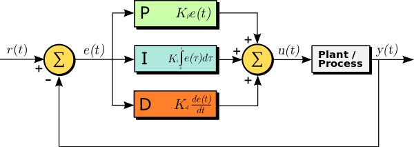

# CarND-Controls-PID
Self-Driving Car Engineer Nanodegree Program

---

## Result Demonstration
### Video demonstration

[](https://youtu.be/-OvcFFYefM8)


## Dependencies

* cmake >= 3.5
 * All OSes: [click here for installation instructions](https://cmake.org/install/)
* make >= 4.1(mac, linux), 3.81(Windows)
  * Linux: make is installed by default on most Linux distros
  * Mac: [install Xcode command line tools to get make](https://developer.apple.com/xcode/features/)
  * Windows: [Click here for installation instructions](http://gnuwin32.sourceforge.net/packages/make.htm)
* gcc/g++ >= 5.4
  * Linux: gcc / g++ is installed by default on most Linux distros
  * Mac: same deal as make - [install Xcode command line tools]((https://developer.apple.com/xcode/features/)
  * Windows: recommend using [MinGW](http://www.mingw.org/)
* [uWebSockets](https://github.com/uWebSockets/uWebSockets)
  * Run either `./install-mac.sh` or `./install-ubuntu.sh`.
  * If you install from source, checkout to commit `e94b6e1`, i.e.
    ```
    git clone https://github.com/uWebSockets/uWebSockets 
    cd uWebSockets
    git checkout e94b6e1
    ```
    Some function signatures have changed in v0.14.x. See [this PR](https://github.com/udacity/CarND-MPC-Project/pull/3) for more details.
* Simulator. You can download these from the [project intro page](https://github.com/udacity/self-driving-car-sim/releases) in the classroom.

Fellow students have put together a guide to Windows set-up for the project [here](https://s3-us-west-1.amazonaws.com/udacity-selfdrivingcar/files/Kidnapped_Vehicle_Windows_Setup.pdf) if the environment you have set up for the Sensor Fusion projects does not work for this project. There's also an experimental patch for windows in this [PR](https://github.com/udacity/CarND-PID-Control-Project/pull/3).


## Basic Build Instructions

1. Clone this repo.
2. Make a build directory: `mkdir build && cd build`
3. Compile: `cmake .. && make`
4. Run it: `./pid`. 
5. Run the simulator


## PID Controller Description
Proportional–Integral–Derivative controller (PID controller) is the most common used control method in industry. A PID controller collects data and attempts to minimize the error (CTE in this case) over time by adjustment of a control variable u(t) (steering value in this case).

In this model:

- **Term P** is proportional to the current value of  error e(t). The proportional coefficient is called gain factor "Kp". "Kp" usually can accelerate the system response. However, if the "Kp" is too high, it may lead to a large overshoot and the system can become unstable.

- **Term I** accounts for past values of error and integrates them over time to produce the I term. The proportional coefficient is called gain factor "Ki". "Ki" contributes to the decrease of overshoot and oscillation, leading to a more stable system. It can also deal with system bias problem. But a large" Ki" would increase the error elimination time.

- **Term D** is a best estimate of the future trend of the error, based on its current rate of change. The proportional coefficient is called gain factor "Kd". A larger "Kd" could accelerate the system response and decrease the overshoot while leading to a worse disturbance rejection ability.



### PID Controller Demo (Graph)

### PID Controller Demo (Simulator)
##### P Controller

##### PD Controller

##### PID Controller


## PID Hyperparameters Tuning

In this project, the hypermeters Kp, Ki and Kd have been manually tuned by inspecting the driving performance in the simulator. The tunning order is P -> I -> D. 

A large Kp will lead to an unstable system. Oscillation is very dangerous and uncomfortable in self-driving car. Thus a Kp of 0.16 is set. A small Ki can reduce error elimination time and is thus set to 0.0008. Finally Kd can decrease overshoot problem and is set to 1.