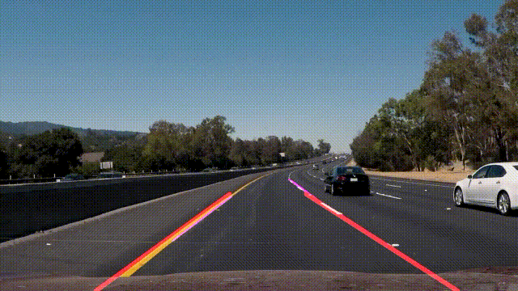
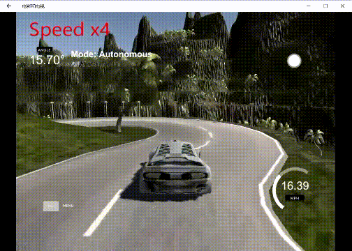
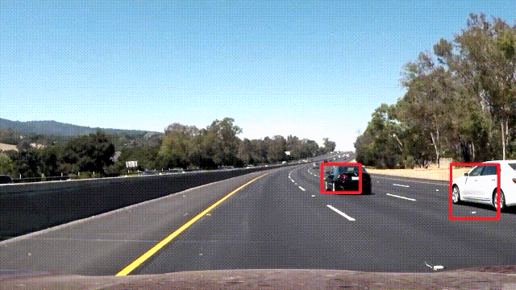

# **Self-Driving Car Engineer**
*Udacity Self-Driving Car Engineer Nano Degree projects.*

## Currently finished projects:
- 1, Finding Lane Lines
- 2, Traffic Sign Classifier
- 3, Behavioral Cloning
- 4, Advanced Lane Finding
- 5, Vehicle Detection and Tracking

## Demonstration

### 1. [Finding Lane Lines](https://github.com/joeyzhong90595/Self-Driving-Car-Engineer-Projects/tree/master/P1-Finding-Lane-Lines)
Use basic computer vision techniques, Canny Edge Detection and Hough Transform for instance, to detect lanes in some video streams taken from a running car.

#### Video demonstration:

### 2. [Traffic Sign Classifier](https://github.com/joeyzhong90595/Self-Driving-Car-Engineer-Projects/tree/master/P2-Traffic-Sign-Classifier)
Classify 43 classes of traffic signs from data set "[GTSRB](http://benchmark.ini.rub.de/)" using LeNet deep neural network architecture with the help of TensorFlow.

### 3. [Behavioral Cloning](https://github.com/joeyzhong90595/Self-Driving-Car-Engineer-Projects/tree/master/P3-Behavioral-Cloning)
With the help of Udacity Self-Driving Car Simulator, implement a deep neural network to train a self-driving car to finish 2 required tracks.

#### Video demonstration:

### 4. [Advanced Lane Finding](https://github.com/joeyzhong90595/Self-Driving-Car-Engineer-Projects/tree/master/P4-Advanced-Lane-Finding)
Use advanced computer vision algorithm such as Sobel Edge Detection, Perspective Transform, to percisely locate the tow lanes next to our vehicle.

#### Video demonstration:

### 5. [Vehicle Detection and Tracking](https://github.com/joeyzhong90595/Self-Driving-Car-Engineer-Projects/tree/master/P5-Vehicle-Detection-And-Tracking)

#### Video demonstration:

