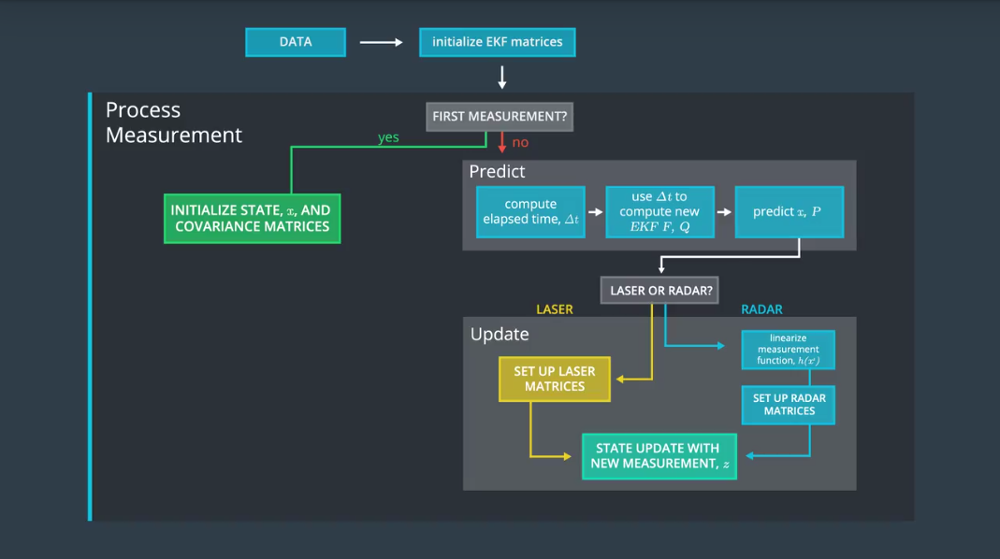
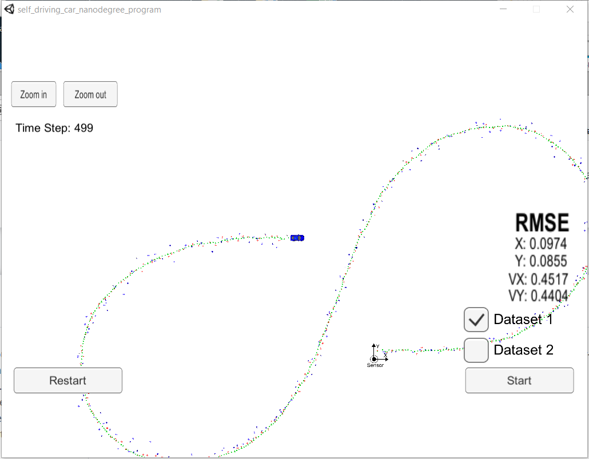
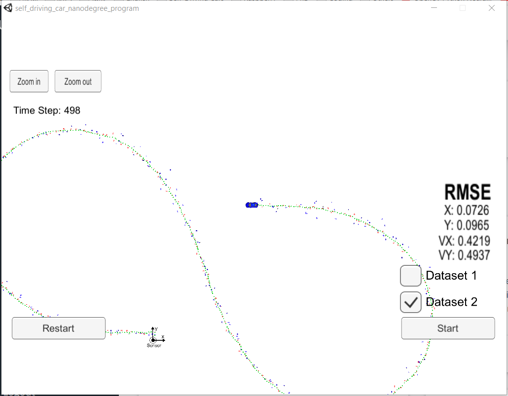

# Extended Kalman Filter Project Starter Code
Self-Driving Car Engineer Nanodegree Program

---

In this project, a kalman filter to estimate the state of a moving object of interest with noisy lidar and radar measurements is implemented. The project requires obtaining RMSE values that are lower than the tolerance outlined in the project rubric, which is [0.11, 0.11, 0.52, 0.52].



This project involves the Term 2 Simulator which can be downloaded [here](https://github.com/udacity/self-driving-car-sim/releases)


## Result Demonstration
#### Video demonstration dataset1 and dataset2

[](https://youtu.be/iN-Bf5Ay5Bc)


## Dependencies

* cmake >= 3.5
 * All OSes: [click here for installation instructions](https://cmake.org/install/)
* make >= 4.1(mac, linux), 3.81(Windows)
  * Linux: make is installed by default on most Linux distros
  * Mac: [install Xcode command line tools to get make](https://developer.apple.com/xcode/features/)
  * Windows: [Click here for installation instructions](http://gnuwin32.sourceforge.net/packages/make.htm)
* gcc/g++ >= 5.4
  * Linux: gcc / g++ is installed by default on most Linux distros
  * Mac: same deal as make - [install Xcode command line tools]((https://developer.apple.com/xcode/features/)
  * Windows: recommend using [MinGW](http://www.mingw.org/)
* [uWebSockets](https://github.com/uWebSockets/uWebSockets)
  * Run either `install-mac.sh` or `install-ubuntu.sh`.
  * If you install from source, checkout to commit `e94b6e1`, i.e.
    ```
    git clone https://github.com/uWebSockets/uWebSockets
    cd uWebSockets
    git checkout e94b6e1
    ```
    Some function signatures have changed in v0.14.x. See [this PR](https://github.com/udacity/CarND-MPC-Project/pull/3) for more details.


* [Eigen](http://eigen.tuxfamily.org/index.php?title=Main_Page). This is already part of the repo so you shouldn't have to worry about it.
* Simulator. You can download these from the [releases tab](https://github.com/udacity/self-driving-car-sim/releases).

## Basic Build Instructions

1. Clone this repo.
2. Make a build directory: `mkdir build && cd build`
3. Compile: `cmake .. && make` 
   * On windows, you may need to run: `cmake .. -G "Unix Makefiles" && make`
4. Run it: `./ExtendedKF `
5. Run simulator

## Accuracy

This project requires high accuracy of estimating state of a moving vehicle using noisy radar and lidar measurement. A RMSE less than [.11, .11, 0.52, 0.52] is demanded.

When running in dataset1, RMSE starts from about [0.18, 0.08, 4.3, 1.14] and gradually decreases to about[0.1, 0.09, 0.45, 0.44].

When running in dataset2, RMSE starts from [0.11, 0.16, 3.7, 2.8] and gradually decreases to about [0.07, 0.1, 0.42, 0.49].

#### dataset1

#### dataset2
